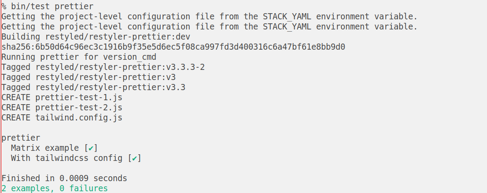

# Restylers

Language-specific restylers.

## Tests

1. Install [`restyle`][install-restyle]
2. Install [The Haskell Tool Stack][install-stack]
3. Run `bin/test <restyler>`

[install-restyle]: https://github.com/restyled-io/restyler?tab=readme-ov-file#installation
[install-stack]: https://docs.haskellstack.org/en/stable/#how-to-install-stack

## Releasing

Merges to `main` automatically tag versions, release a manifest at that
tag, and update the `dev` manifest.

The Promote workflow can be run manually to promote any tag to another,
typically to promote `dev` to `stable`. It also runs twice a month.

## LICENSE

What minimal code and configuration there is in this repository is itself
[Commons Claused][cc], MIT licensed, as is all of Restyled's codebase. Projects
installed into the Docker images defined here are governed by their own
licenses.

For a detailed description of another project's rationale for this licensing
model, one with which I agree, see [here][level].

[cc]: https://commonsclause.com/
[level]: https://web.archive.org/web/20181120030157/https://leveljournal.com/source-available-licensing
